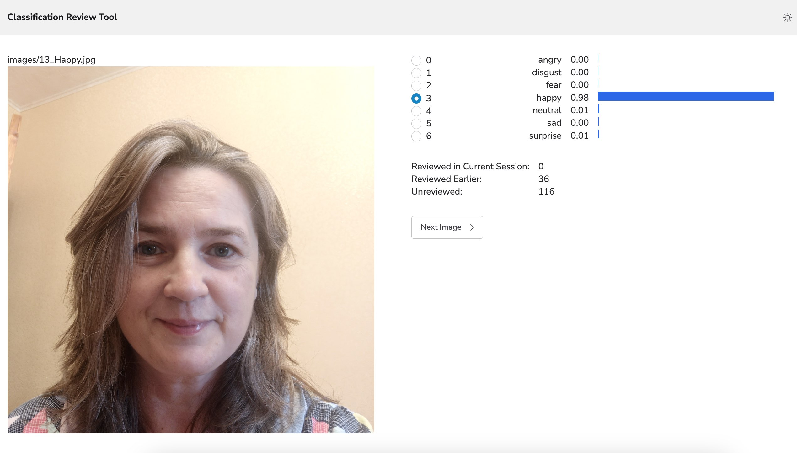

@ -1 +1,46 @@
# Image Classification Review Tool



- Use Up/Down arrows to switch between labels
- Use Right arrow to save current label and get a new image

### Example `predictions.json` file with raw predictions
```
{
  "images/12_Happy.jpg": [
    { "label": "happy", "score": 0.9760520458221436 },
    { "label": "surprise", "score": 0.007539073470979929 },
    { "label": "neutral", "score": 0.00606749951839447 },
    { "label": "sad", "score": 0.003563844133168459 },
    { "label": "fear", "score": 0.002640938386321068 }
  ],
  "images/10_Contempt.jpg": [
    { "label": "happy", "score": 0.8121405839920044 },
    { "label": "surprise", "score": 0.057953134179115295 },
    { "label": "neutral", "score": 0.046099040657281876 },
    { "label": "fear", "score": 0.031888220459222794 },
    { "label": "angry", "score": 0.02385363169014454 }
  ]
  ...
}
```

### Example `output.json` file with reviewed labels.
```
{
    "neutral": [
        "images/0_Anger.jpg",
        "images/0_Contempt.jpg",
        "images/0_Neutral.jpg",
        "images/0_Surprised.jpg",
        "images/10_Neutral.jpg",
        "images/11_Sad.jpg",
        "images/12_Neutral.jpg",
    ],
    "fear": [
        "images/0_Fear.jpg",
        "images/10_Surprised.jpg",
        "images/13_Disgust.jpg"
    ]
    ...
}
```

Made with [HyperDiv](https://github.com/hyperdiv/hyperdiv)
